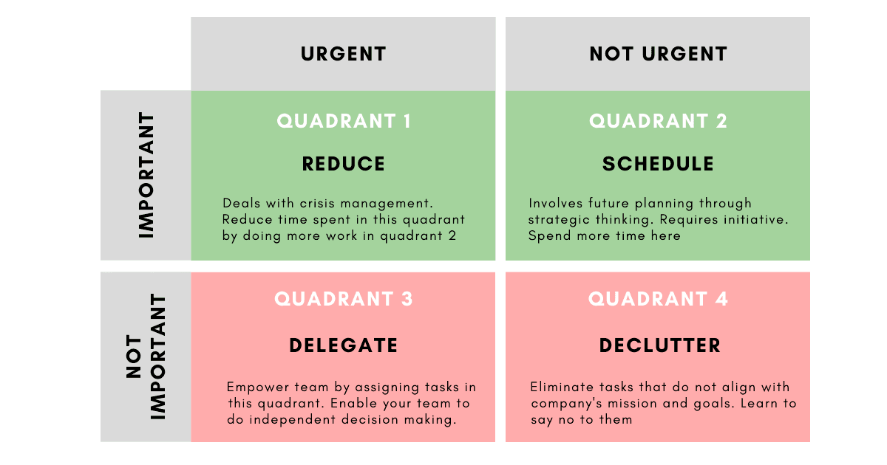

# The Product Manager Course

# Table of Contents

- The Value Exchange System
- Einshower Matrix

## The Value Exchange System

The most atomic value from our customer is :

1. Problem
2. Want
3. Need

---

## Einshower Matrix

Source : https://www.techtello.com/eisenhower-productivity-matrix/

### **Quadrant 1 – Crisis Management**

Tasks in this quadrant are Important and Urgent that deals with the crisis. Work produced here is low quality as decisions and solutions are made in haste (due to time limitations).

While getting these tasks done provides instant gratification, this quadrant gets bigger and bigger until it consumes us leaving us drained and burnout without significant contribution to our goals. 

People who spend a lot of their time in this quadrant jump from one situation to the next **fooling themselves into believing that it will go away once they attend to it.** 

### **Quadrant 2 – Plan for the future**

While it’s not possible to completely avoid crisis, carefully  planning work that aligns with long term goals while taking risk and other factors into account will involve less crisis creating a  self-perpetuating cycle that will free up more time to do forward  looking work.

Our natural tendency is to deal with the urgent while delaying  important work. Spending more time in this quadrant will require exercising control as it will be the biggest driver in achieving  significant results and creating value for the organisation and its  people. 

### **Quadrant 3 – Win-Win situations**

People with short term focus who act out of priorities defined by others can feel out of control as they need to execute on others expectations. Such people make mistakes as they treat not important work also as important and execute as though in quadrant 1. 

To separate important from not important requires careful examination, understanding and setting your own priorities. 

Tasks in this quadrant are perfect candidates to entrust your team with more responsibilities and empower them to make independent decisions. Delegating work in this manner will not only free up your time to do work that requires careful planning (quadrant 2), but also establish trust with your team  members creating a win-win situation at work. 

### **Quadrant 4: Declutter your work**

Separate work that’s useful and will truly add value from the one  that tricks you into feeling important by keeping you busy (not  important, not urgent). Once you have clearly separated it out, apply konmari method and declutter your work. 

Learn to say no to tasks (first to yourself and then to others) that are not urgent and not aligned with the goals of your team and company. These not  important, not urgent tasks are time wasting efforts that can abdicate  you from providing true value to your organisation and your people.  

---

## Business Goals? 

## Success Metrics? 

## Competitive Analysis?

 

## Project Scope?